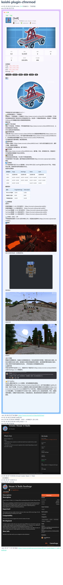

# koishi-plugin-cfmrmod-napi-yabo

Koishi 插件：搜索 CurseForge / Modrinth / MCMod，并渲染图片卡片（独立维护版）。

## 开发此版本插件原因

由于原作者插件在本人生产环境下出现棍木图片（只有图片没有文字），遂更换canvas实现，采用维护积极的@napi-rs/canvas包作为底层。

经过排版调整，现在可完整显示表格、图片、emoji等元素（虽然原插件也覆盖了90%），并且修复了原作者提到的bug，并引入了两个新bug（？）：

1. 日志图片获取报错：发生在获取mcmod页图片时，具体原因未知，linux和win上还不一样
2. koishi插件内的手动打开的 **Switch** 会在重载插件时，自动关闭，但好像也不影响使用
3. 配置略麻烦，需要有点npm使用经验，详情见下。但使用只需记忆指令即可，无需在koishi控制台做任何配置。
4. 感谢原作者实现的优秀功能！

## 前置依赖

- **必须手动安装 `@napi-rs/canvas`，否则图片生成功能会被禁用。**
- 在 Koishi 实例目录执行：

```bash
npm i @napi-rs/canvas
```

### Emoji 字体说明

- 为了保证 emoji 与符号显示，建议在系统安装至少一套 emoji 字体：
  - Linux: `Noto Color Emoji`
  - Windows: `Segoe UI Emoji`
  - macOS: `Apple Color Emoji`
- 插件会尝试自动注册系统字体并在日志输出当前可用字体列表。

## 使用方法

### 指令

- `cf <关键词>`：默认搜索 CurseForge Mod
- `cf.mod/.pack/.resource/.shader/.plugin <关键词>`
- `mr <关键词>`：默认搜索 Modrinth Mod
- `mr.mod/.pack/.resource/.shader/.plugin <关键词>`
- `cnmc <关键词>`：默认搜索 MCMod Mod
- `cnmc.mod/.data/.pack/.tutorial/.author/.user <关键词>`
- `cf.help` / `mr.help` / `cnmc.help`

#### 更新通知（notify）

- `notify.add <platform> <projectId>` 添加订阅
- `notify.remove <platform> <projectId>` 删除订阅
- `notify.list` 列出订阅
- `notify.enable <onoff>` 启用/禁用本群通知
- `notify.check [arg] [-b]` 手动检查更新（arg 为序号或 projectId；-b 强制发送最新卡片）
- `notify.helpme` 查看完整参数说明

参数说明：

- `<platform>`：平台代码，`mr`=Modrinth，`cf`=CurseForge
- `<projectId>`：平台项目 ID（不是名称）
- `<onoff>`：`on/off` 或 `true/false`
- `[arg]`：`notify.check` 的参数，可填订阅序号或 `projectId`
- `-b`：强制发送最新卡片（忽略是否更新）

列表交互：输入序号查看，`n` 下一页，`p` 上一页，`q` 退出。

### 配置要点

#### 通用

- `prefixes`: 设置 `cf` / `mr` / `cnmc` 指令前缀
- `timeouts`: 搜索会话超时（毫秒）
- `debug`: 调试日志开关
- `render.image.fetchWithHeaders`: 图片是否启用带 Referer/Cookie 的 HTTP 抓取解码（默认开启）
- `render.emoji.twemoji`: 是否启用 Twemoji 兜底（默认开启）
- `render.emoji.cdn`: Twemoji CDN 地址前缀（默认 jsDelivr）

#### 更新通知（notify）

- `notify.enabled`: 是否开启更新通知
- `notify.interval`: 全局轮询间隔（毫秒）
- `notify.adminAuthority`: 权限等级（1=全部，2=管理员+群主，3=仅群主）
- `notify.stateFile`: 状态文件路径（JSON）
- `notify.configFile`: 订阅配置文件路径（JSON，指令修改会写入）
- `notify.groups`: 通知群组列表
  - `channelId`: 群/频道 ID
  - `enabled`: 是否启用本群通知
  - `subs`: 订阅列表
    - `platform`: `mr` 或 `cf`
    - `projectId`: 项目 ID
    - `interval`: 单独轮询间隔（毫秒），<=0 禁用

## 项目特点

- 支持 CurseForge / Modrinth / MCMod 多平台搜索
- 结果以图片卡片形式展示
- 支持多类型内容（模组/整合包/教程/作者/用户等）
- 可配置前缀与超时等通用参数

## 演示


